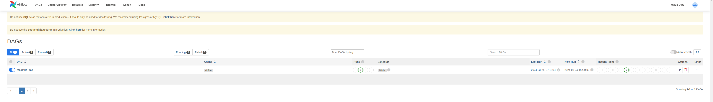
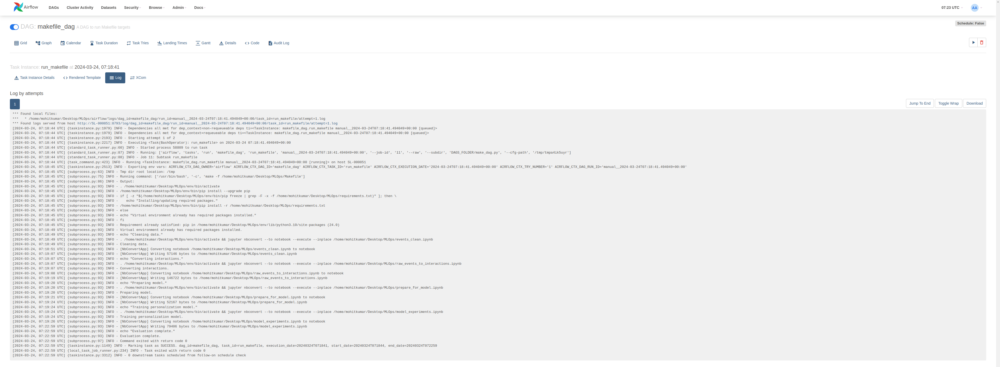

# Polls Recommendation System (MLOps Assignment)

## Overview

This project implements a Polls Recommendation System designed to offer both personalized and popular poll recommendations to users. It leverages real-time data processing and machine learning to ensure dynamic and relevant recommendations.

Currently, this project executes the complete workflow through a Makefile, although I did try to get my hands dirty with Airflow and Dagster to write the whole workflow in that. However, with limited time, I had to pick the simplest and most direct approach, which is through the Makefile. But yes, this is not the standard and best way to do this - this project has a lot of scope for improvements in workflow.

## [System Architecture](docs/architecture.md)

### Key Components

- **Kafka**: Manages real-time event streams.
- **Flink**: Handles stream processing and feature extraction.
- **Feast**: Serves as the feature store.
- **Machine Learning Models**: Includes personalization and popular polls models.
- **FastAPI**: Acts as the API gateway.
- **Redis**: Used for temporary storage and caching.

For more detailed instructions, refer to the individual component documentation within the [architecture.md](docs/architecture.md) directory.

## Getting Started

To set up the project:

1. Ensure you have Python 3.10 installed.
2. Ensure you have Makefile installed.
3. Create a virtual environment and install all dependencies from `requirements.txt`.
4. Set `export AIRFLOW_HOME=<present-working-directory>`.
5. Initialize the database with `airflow db init`.
6. Create a user with the following command:
`airflow users create
--role Admin
--username admin
--email admin@example.com
--firstname Admin
--lastname User
--password admin`
7. Start the server and access it at `localhost:8080`.

## Project Structure

- `airflow/`: Contains DAG definitions for workflow orchestration.
- `data/`: Houses raw and prepared datasets.
- `docker/`: Docker configuration files. (Currently redundant)
- `docs/`: Documentation files, including architecture overview.
- `mlops/`: MLOps utilities for model evaluation and deployment.
- `notebooks/`: Jupyter notebooks for exploration and model experimentation.

### Important Points

1. This DAG runs with a frequency for daily and saves the personalized_model.pkl in the trained_model directory.
2. The Makefile has all the logic to run the whole workflow in sequence.
3. Decorators for logging and time profiling have been added to all functions in `utils.py` and `evaluate.py`.
4. The DAG runs this workflow daily.
5. A pre-commit hook has been added which executes `process_notebooks.sh` file to identify all the added notebook files, run them, export them as HTMLs, and then strip them of their output.

## Job Running Snippets

Feel free to reach out at krmohit101@gmail.com for any queries.